# Data Portfolio: Excel --> SQL --> Power --> R (Interview Task)	
# Presented by SALAWUDEEN IBRAHIM

## Cancer incidence (diagnoses) in the East of England

### Data Source: https://www.cancerdata.nhs.uk/covid-19/rcrd (Geography Tab > Downloads > Download incidence and stage time trend data for all Cancer Alliances and cancer sites (~15 MB))																	
Date Downloaded: 18th November 2024	


# Table of contents 

- [Introduction](#introduction)
- [Objective](#objective)
- [Stages](#stages)
- [Design](#design)
  - [Tools](#tools)
- [Development](#development)
  - [Pseudocode](#pseudocode)
  - [Data Exploration](#data-exploration)
  - [Data Cleaning](#data-cleaning)
  - [Transform the Data](#transform-the-data)
  - [Create the SQL View](#create-the-sql-view)
- [Testing](#testing)
  - [Data Quality Tests](#data-quality-tests)
- [Visualization](#visualization)
  - [Results](#results)
  - [DAX Measures](#dax-measures)
- [Analysis](#analysis)
  - [Findings](#findings)
  - [Validation](#validation)
  - [Discovery](#discovery)
- [Recommendations](#recommendations)
  - [Potential ROI](#potential-roi)
  - [Potential Courses of Actions](#potential-courses-of-actions)
- [Conclusion](#conclusion)

# Introduction

The statistic that one in two people will develop cancer in their lifetime underscores the growing importance of understanding cancer patterns, both globally and regionally. This figure reflects advancements in life expectancy, with age being the most significant risk factor for cancer. It also points to the increasing need for early detection, effective prevention, and well-resourced healthcare systems to manage this rising burden.
Research by Cancer Research UK highlights that over 60% of cancer cases occur in individuals aged 65 and older. Factors like smoking cessation, regular physical activity, moderate alcohol consumption, and maintaining a healthy weight could prevent over 40% of cancer cases each year in the UK. These findings emphasise the dual role of medical advancements and public health initiatives in addressing the cancer epidemic.
Understanding regional cancer trends, such as those in the East of England, becomes critical for planning targeted healthcare responses. Geographic-specific data can help allocate resources, identify high-incidence cancer types, and tailor prevention campaigns to regional demographics.
(Ahmad et al., British Journal of Cancer, 2015), which analysed how lifetime cancer risks have shifted over decades.


# Objective 

- What is the key pain point? 

Analyse cancer diagnoses data for the East of England to uncover trends and actionable insights.

# Aim
To investigate regional patterns of cancer incidence in the East of England, identify trends in diagnoses by cancer type, and provide actionable insights for healthcare planning and targeted interventions. 

This aim focuses not only on presenting data but also on interpreting it for meaningful action. It considers public health implications, emphasising regional and national comparisons, and highlights the importance of targeted responses.


- What is the ideal solution? 

To create a dashboard that provides insights into cancer incidence in the East of England that includes their 
- Geography type
- Geography
- Year
- Month
- Date
- Cancer group
- Metric
- Statistic


This will help provide insights into cancer incidence in the East of England.

# Stages

- Design
- Developement
- Testing
- Analysis 


# Design 

## Dashboard components required 
- What should the dashboard contain based on the requirements provided?

To understand what it should contain, we need to figure out what questions we need the dashboard to answer:

1. Who are the top 10 cancer groups?
2. Which 3 cancer groups have the most Statistic (Cancer diagnoses)?
3. Which 3 cancer groups have the highest average statistic?
4. Which 3 cancer groups have the highest percentage by cancer type?
5. Which 3 cancer groups have the highest Region diagnosis rate?
6. Cancer group moving average (3 and 12) to see the trend relating to the date.
7. Time series analysis (Arima Model), Forecasting, Residue and P-value.


For now, these are some of the questions we need to answer, this may change as we progress down our analysis. 


## Dashboard mockup

- What should it look like? 

Some of the data visuals that may be appropriate in answering our questions include:

1. Table
2. Treemap
3. Scorecards
4. Horizontal bar chart 


## Tools 


| Tool | Purpose |
| --- | --- |
| Excel | Exploring the data |
| SQL Server | Cleaning, testing, and analyzing the data |
| Power BI | Visualizing the data via interactive dashboards |
| R| forecasting requirements as outlined in the job description|
| GitHub | Hosting the project documentation and version control|
| Mokkup AI | Designing the wireframe/mockup of the dashboard | 

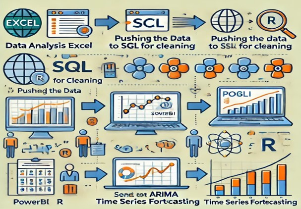

# Development

## Pseudocode

- What's the general approach in creating this solution from start to finish?

1. Get the data
2. Explore the data in Excel
3. Load the data into SQL Server
4. Clean the data with SQL
5. Test the data with SQL
6. Visualize the data in Power BI
7. Generate the findings based on the insights
8. Write the documentation + commentary
9. Publish the data to GitHub Pages

## Data exploration notes

Data contain 8 columns (Geography type, Geography, Year, Month, Date, Cancer group, Metric, Statistic) and 134380 rows.


- The initial observations with this dataset? What's caught my attention so far?

  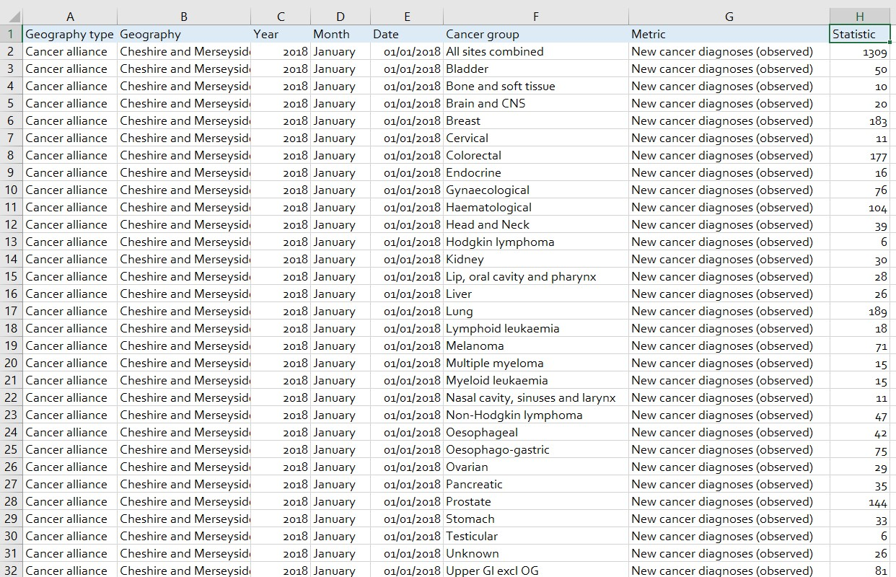

In this phase, Excel is used for Exploratory Data Analysis (EDA) to assess and clean the dataset before further processing. 

- Key tasks include:

1. Data Overview and Inspection: Row and Column Count: To ensure completeness, check the total number of records and variables.

2. Filtering and Consistency Check: Filter the data to identify relevant columns for analysis, removing errors and inconsistencies.

3. Distinct Value Check: Identify distinct values in each column to spot discrepancies and remove irrelevant data, such as erroneous or duplicate entries.

- Key Columns Overview:

1. Geography Type: Categorized into three types: Cancer Alliance, ICB (Integrated Care Board), and National.

2. Geography: Contains 63 distinct regions across the East of England.

3. Date Information: Time-based information covering the years 2018 to 2024, with data recorded on the first day of each month.

4. Metric: Describes the statistical measurement of cancer diagnoses (observed) with just one records for each value.

5. Statistic: Numeric values representing the actual cancer diagnoses from 0 to 30216.

## Data cleaning 

- The aim is to refine our dataset to ensure it is structured and ready for analysis. 

The cleaned data should meet the following criteria and constraints:

- Only relevant columns should be retained.
- All data types should be appropriate for the contents of each column.
- No column should contain null values, indicating complete data for all records.

Below is a table outlining the constraints on our cleaned dataset:

| Property | Description |
| --- | --- |
| Number of Rows |134380 |
| Number of Columns | 8 |

Here is a tabular representation of the expected schema for the clean data:

| Column Name | Data Type | Nullable |
| --- | --- | --- |
| Geography type| VARCHAR | NO |
| Geography| VARCHAR | NO |
| Year| VARCHAR | NO |
| Month | VARCHAR | NO |
| Date | VARCHAR | NO |
| Cancer group | VARCHAR | NO |
|  Metric | VARCHAR | NO |
| Statistic| INTEGER | NO |

- What steps are needed to clean and shape the data into the desired format?

1. Remove Unnecessary Columns: Remove irrelevant columns such as Year, Month, and Metric to focus on critical data.
2. Filter Data for East of England: Extract data specific to the East of England region from the geography column (Geography_type, Geography, Date, Cancer_group and Statistic).
3. Format Date Column: Ensure the Date column is in the appropriate date format for consistent analysis (year-month-day=yy/mm/dd).
4. Remove Outliers: Exclude the outlier 'ALL SITES COMBINED' from the Cancer Group column to prevent skewed results.
5. Rename Columns: Rename Geography to Region and Statistic to Cancer_Diagnoses for clarity.
6. View: Create a view so the that can be pushed to power bi.


### Transform the data 


```sql
SELECT 
    Geography_Type,
    Geography AS Region, -- Rename Geography to Region
    CONVERT(DATE, Date, 103) AS Date, -- Format the Date column to proper date format
    Cancer_Group,
    Statistic AS Cancer_Diagnoses     -- Rename Statistic to Cancer_Diagnoses
FROM 
    NHS_CANCER
WHERE 
    Geography = 'East of England'
    AND Cancer_Group != 'All sites combined';
```


### Create the SQL view 

```sql
/*
#1. REMOVE UNNECESSARY COLUMNS (YEAR, MONTH, MATRIC) BY ONLY SELECTING THE ONE WE NEED.

#2. EXTRACT DATA OF EAST OF ENGLAND FROM THE GEOGRAPHY COLUMN.

#3. Format the date column to the appropreate format

#4. REMOVING THE OUTLIER (ALL SITES COMBINED) from Cancer_group 

#5. RENAME THE COLUMN SUCH AS GEOGRAPHY TO REGION AND STATISTIC TO CANCER_DIAGNOSES
*/

-- 1.
Create View for Importation to PowerBi

CREATE VIEW NHS_DATA AS

-- 2.
SELECT 
    Geography_Type,
    Geography AS Region, -- Rename Geography to Region
    CONVERT(DATE, Date, 103) AS Date, -- Format the Date column to proper date format
    Cancer_Group,
    Statistic AS Cancer_Diagnoses     -- Rename Statistic to Cancer_Diagnoses
-- 3.
FROM 
    NHS_CANCER
WHERE 
    Geography = 'East of England'
    AND Cancer_Group != 'All sites combined';

```
 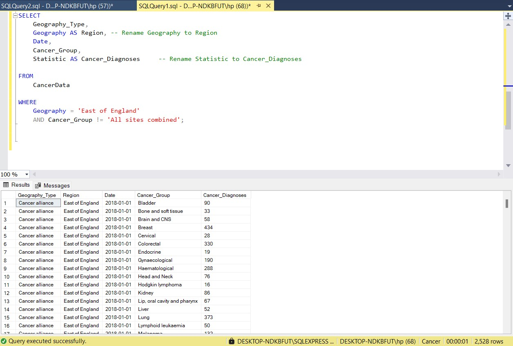

 # Testing 

- Data quality and validation checks

Here are the data quality tests conducted:

1. Row count check

2. Column count check (5)

3. Data typle check (string format, data format and numerical)

4. Duplicate count check ( each records must be unique in the dataset)

5.  Check for Null or Empty Values

6. Outliers check

## EXPECTATION

Row count < 134380 

Column count = 5

Geography_Type = varchar

Region = varchar

Date = Date format

Cancer_Group = varchar

Cancer_Diagnoses = Numerical/Integer

Duplicate = 0

Null value or empty check = 0

### Row count check
```sql
/*
# Rows count check
*/

Select COUNT(*) AS NO_Of_Rows
from NHS_DATA;

```

## Column count check
### SQL query 
```sql
/*
# Columns count check
*/

Select 
   COUNT (*) AS column_count 
From 
   INFORMATION_SCHEMA.COLUMNS
WHERE 
   TABLE_NAME = 'NHS_DATA';
```
### Output 
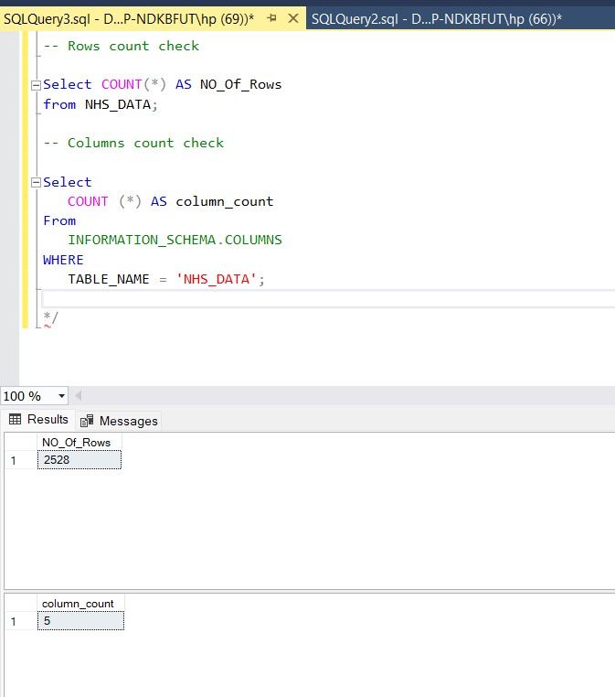


## Data type check
### SQL query 
```sql
/*
# Check the data types of each column from the view by checking the INFORMATION SCHEMA view
*/

-- 1.
Select *
From 
   INFORMATION_SCHEMA.COLUMNS
WHERE 
   TABLE_NAME = 'NHS_DATA';

Select 
   COLUMN_NAME,
   DATA_TYPE
From 
   INFORMATION_SCHEMA.COLUMNS
WHERE 
   TABLE_NAME = 'NHS_DATA'
```
### Output
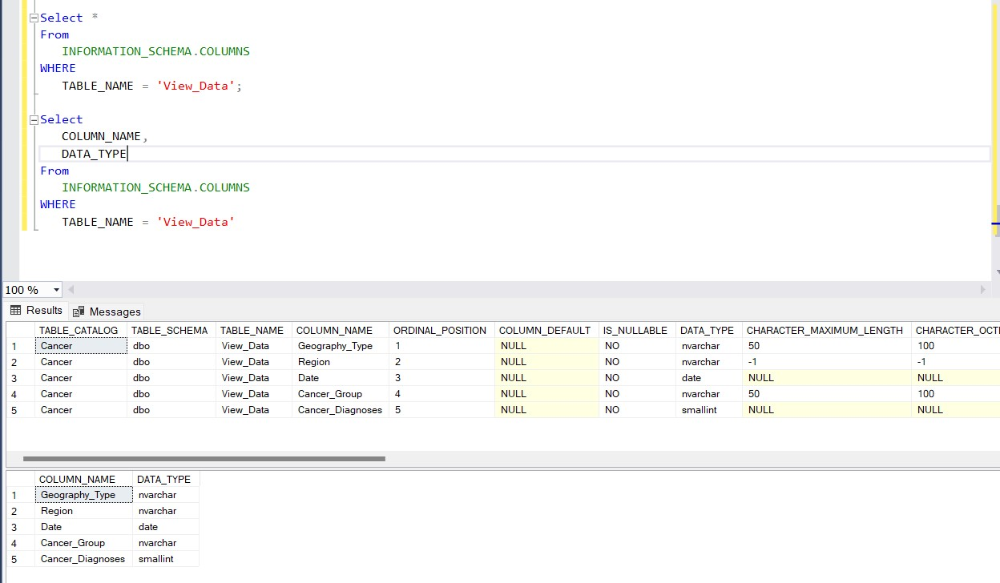


## Duplicate count check
### SQL query 
```sql
/*
# 1. Check for duplicate rows in the view
# 2. Group by the Geography_Type, Region, Date, Cancer_Group, Cancer_Diagnoses.
# 3. Filter for groups with more than one row
*/

-- 1.
SELECT 
    COUNT(*) AS Total_Duplicates
FROM (SELECT Geography_Type, Region, Date, 
      Cancer_Group, Cancer_Diagnoses,
        COUNT(*) AS Duplicate_Count
    FROM 
        NHS_DATA
-- 2.
GROUP BY 
        Geography_Type, Region, Date,
        Cancer_Group, Cancer_Diagnoses
-- 3.
HAVING 
        COUNT(*) > 1 -- Identifies duplicates
) AS Duplicates;
```
### Output
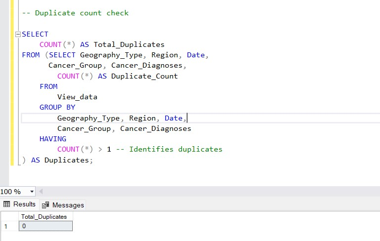


## Null value or empty check
### SQL query 
```sql
/*
# 1. Check empty roll value in the view
# 2. Base on each of the column
*/

-- 1.
SELECT 
    COUNT(*) AS Total_Empty_Or_Null_Values
FROM 
    NHS_DATA
-- 2.
WHERE 
    Geography_Type IS NULL OR Geography_Type = ''
    OR Region IS NULL OR Region = ''
    OR Date IS NULL OR Date = ''
    OR Cancer_Group IS NULL OR Cancer_Group = ''
    OR Cancer_Diagnoses IS NULL OR Cancer_Diagnoses = '';
```
### Output
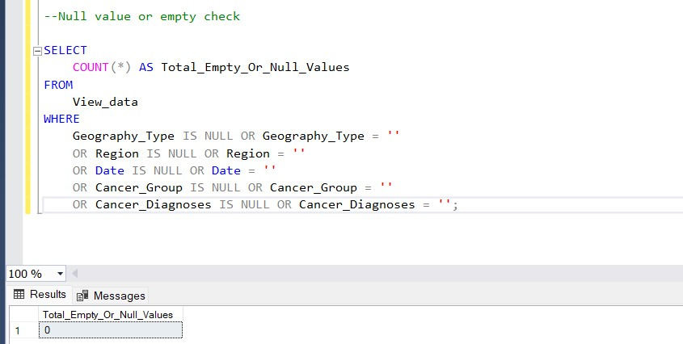


## Outliers check
### SQL query 
```sql
/*
# 1. Calculate Q1, Q3, and IQR for each Cancer_Group.
# 2. Find the outlier in the Cancer_diagnoses column.
# 3. The outlier must not affect the analysis
*/

-- 1.
WITH Quartiles AS (
    SELECT 
        Cancer_Group,
        PERCENTILE_CONT(0.25) WITHIN GROUP (ORDER BY Cancer_Diagnoses) 
            OVER (PARTITION BY Cancer_Group) AS Q1,
        PERCENTILE_CONT(0.75) WITHIN GROUP (ORDER BY Cancer_Diagnoses) 
            OVER (PARTITION BY Cancer_Group) AS Q3
    FROM NHS_DATA
),
-- 2.
IQR_Calculation AS (
    SELECT DISTINCT 
        Cancer_Group,
        Q1,
        Q3,
        (Q3 - Q1) AS IQR,
        (Q1 - 1.5 * (Q3 - Q1)) AS Lower_Bound,
        (Q3 + 1.5 * (Q3 - Q1)) AS Upper_Bound
    FROM Quartiles
),
-- 3.
Outlier_Flagged AS (
    SELECT 
        d.Cancer_Group,
        d.Cancer_Diagnoses,
        i.Lower_Bound,
        i.Upper_Bound,
        CASE 
            WHEN d.Cancer_Diagnoses < i.Lower_Bound OR d.Cancer_Diagnoses > i.Upper_Bound THEN 1
            ELSE 0
        END AS Is_Outlier
    FROM NHS_DATA d
    JOIN IQR_Calculation i
    ON d.Cancer_Group = i.Cancer_Group
)
-- 4.
Display records with outlier flag, bounds, and actual outlier values
SELECT 
    Cancer_Group,
    Cancer_Diagnoses,
    Lower_Bound,
    Upper_Bound,
    CASE 
        WHEN Is_Outlier = 1 THEN Cancer_Diagnoses
        ELSE NULL
    END AS Outlier_Value,
    Is_Outlier
FROM Outlier_Flagged
ORDER BY Cancer_Group, Cancer_Diagnoses;
```
### Output
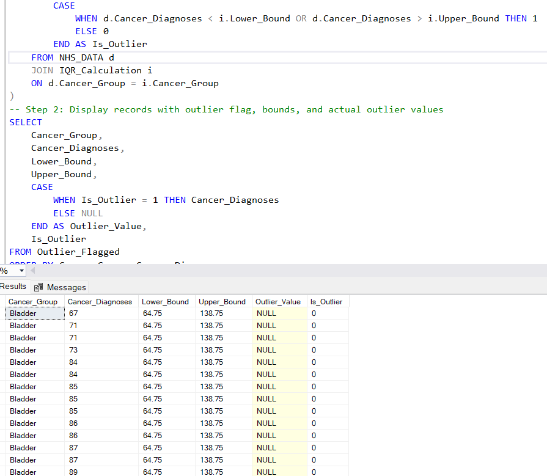

# Visualization 


## Results


This shows the Cancer Incidence trend in the east of england. 

## DAX Measures

### 1. Total cancer Diagnoses 
```DAX
Total Cancer Diagnoses = 
SUM(NHS_DATA[Cancer_Diagnoses])

```

### 2. Total number of cancer type
```DAX
Total No of Cancer Types = 
VAR TotalCancer = DISTINCTCOUNT(NHS_DATA[Cancer_Group])
RETURN TotalCancer

```

### 3. Total number of days
```DAX
Total Number of Days = 
DISTINCTCOUNT(NHS_DATA[Date])

```

### 4. Average cancer diagnoses
```Dax
Average Cancer Diagnoses = 
AVERAGE(NHS_DATA[Cancer_Diagnoses])

```

### 5. Cancer group with the lowest diagnoses
```Dax
CancerGroupLowestDiagnoses = 
VAR MinValue = MIN(NHS_DATA[Cancer_diagnoses])
RETURN
CALCULATE(
    FIRSTNONBLANK(NHS_DATA[Cancer_group], 1),
    NHS_DATA[Cancer_diagnoses] = MinValue
)

```

### 6. Cancer group with the Highest diagnoses
```DAX
CancerGroupHighestDiagnoses = 
VAR MaxValue = [MaxDiagnoses]
RETURN
CALCULATE(
    FIRSTNONBLANK(NHS_DATA[Cancer_group], 1),
    NHS_DATA[Cancer_diagnoses] = MaxValue
)

```

### 7. Month year with highest diagnoses
```DAX
MonthYearHighestDiagnoses = 
VAR MaxValue = [MaxDiagnoses]
RETURN
CALCULATE(
    FORMAT(MAX(NHS_DATA[Date]), "MMMM YYYY"),
    FILTER(NHS_DATA, NHS_DATA[Cancer_diagnoses] = MaxValue)
)


```

### 8. Month year with lowest diagnoses
```DAX
MonthYearLowestDiagnoses = 
VAR MinValue = MIN(NHS_DATA[Cancer_diagnoses])
RETURN
CALCULATE(
    FORMAT(SELECTEDVALUE(NHS_DATA[Date]), "MMMM YYYY"),
    NHS_DATA[Cancer_diagnoses] = MinValue
)

```

### 9. Percentage by cancer type
```DAX
Percentage by Cancer Type = 
DIVIDE(
    SUM(NHS_DATA[Cancer_Diagnoses]),
    CALCULATE(SUM(NHS_DATA[Cancer_Diagnoses]), ALL(NHS_DATA[Cancer_group])),
    0
)

```

### 10. Region diagnoses rate
```DAX
Region Diagnoses Rate = 
DIVIDE(
    SUM(NHS_DATA[Cancer_Diagnoses]),
    CALCULATE(SUM(NHS_DATA[Cancer_Diagnoses]), ALLEXCEPT(NHS_DATA, NHS_DATA[Region]))
) * 100

```

### 11. 12_Month moving average
```DAX
12_Month_Moving_Average = 
AVERAGEX(
    DATESINPERIOD(
        NHS_DATA[Date], 
        LASTDATE(NHS_DATA[Date]), 
        -12, 
        MONTH
    ),
    SUM(NHS_DATA[Cancer_Diagnoses])
)

```

### 12. 3_Month moving average
```DAX
3-Month Moving Average = 
AVERAGEX(
    DATESINPERIOD(
        NHS_DATA[Date],
        LASTDATE(NHS_DATA[Date]),
        -3,
        MONTH
    ),
    SUM(NHS_DATA[Cancer_Diagnoses])
)

```
# Analysis 

## Findings
 
Here are the key questions we need to answer:

1. Who are the top 10 cancer groups?
2. Which 3 cancer groups have the most Statistic (Cancer diagnoses)?
3. Which 3 cancer groups have the highest average Statistic (Cancer diagnoses)?
4. Which 3 cancer groups have the highest percentage by cancer type?
5. Which 3 cancer groups have the highest Region diagnosis rate?
6. Cancer group moving average (3 and 12) to see the trend relating to the date.
7. Time series analysis (Arima Model), Forecasting, Residue and P-value.


### 1. Who are the top 10 cancer groups? and 2. Which 3 cancer groups have the most Statistic (Cancer diagnoses)?


| Rank | Cancer Groups        | Total Cancer Diagnoses |
|------|----------------------|-----------------|
| 1    | Prostate             | 37,874           |
| 2    | Breast               | 36,877           |
| 3    | Colorectal           | 29,681           |
| 4    | Lung                 | 28,489           |
| 5    | Haematological       | 20,019           |
| 6    | Urological exl prostate | 17,893        |
| 7    | Gynaecological       | 13,977           |
| 8    | Upper GI excl OG     | 13,968           |
| 9    | Melanoma             | 11,416           |
| 10   | Oesophago-gastric    | 9,390            |


### 3. Which 3 cancer groups have the highest average Statistic (Cancer diagnoses)?


| Rank | Cancer Group    | Average Cancer Diagnoses |
|------|-----------------|-----------------|
| 1    | Prostate      | 479.42          |
| 2    | Breast        | 466.80          |
| 3    | Colorectal    | 375.71          |


### 4. Which 3 cancer groups have the highest percentage by cancer type?


| Rank | Cancer Group | Percentage by Cancer type |
|------|--------------|-----------------|
| 1    | Prostate       | 12%           |
| 2    | Breast         | 12%           |
| 3    | Colorectal     | 9%            |


### 5. Which 3 cancer groups have the highest Region diagnosis rate?

| Cancer Group | Region Diagnoses Rate |
|--------------|-----------------|
| Prostate     | 12.04           |
| Breast       | 11.72           |
| Colorectal   | 9.43            |


### 6. Which cancer groups has the highest and lowest diagnoses and their date

| Rank | Cancer Group       | Date & Max/min diagnoses    |
|------|-----------------   |---------------------------- |
| High | Prostate           | November 2023 (683)         |
| low  | Nasal cavity, sinuses and larynx | May 2020 (60) |

# R For Time series analysis

### 1. Date column and value column
```R
data$Date <- as.Date(data$Date, format="%Y-%m-%d")

data_ts <- ts(data$Cancer_diagnoses, start=c(2018, 1), frequency=12)
```

### 2. Check for stationarity (important for ARIMA)
```R
adf_result <- adf.test(data_ts)
adf_result$p.value

plot(data_ts)
```
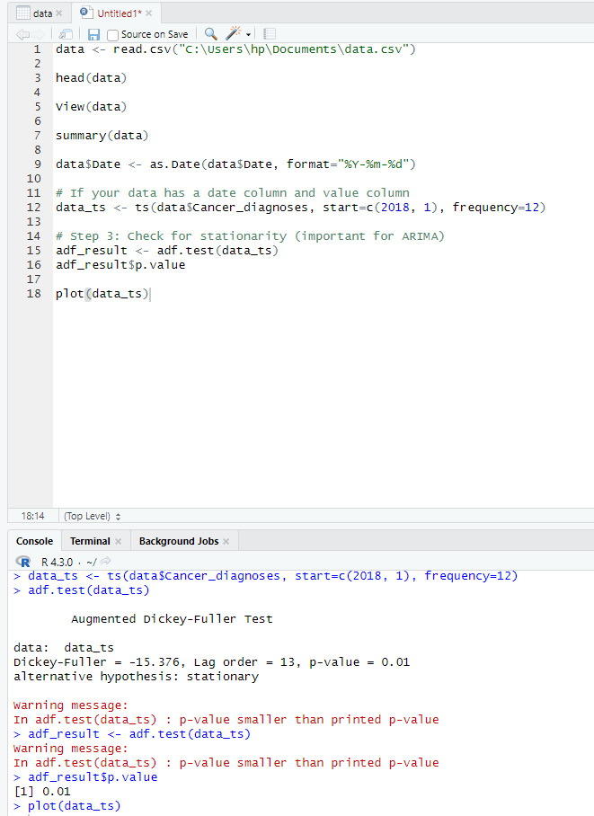

### 3. Differencing if necessary to make the series stationary. This is often done if the Augmented Dickey-Fuller test suggests non-stationarity
```R
data_ts_diff <- diff(data_ts)

plot(data_ts_diff)
```


### 4. Fit an ARIMA model to the data, Automatically selects the best ARIMA model
```R
model <- auto.arima(data_ts)
```

### 5. View the ARIMA model summary
```R
summary(model)
```
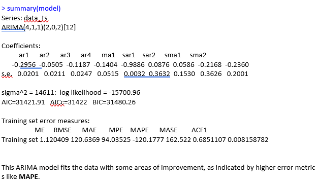

### 6. Forecast future values - Forecast the next 12 periods (e.g., 12 months if monthly data)
```R
forecast_values <- forecast(model, h=12)

- Plot the forecast
plot(forecast_values)

- Print the forecasted values
print(forecast_values)
```
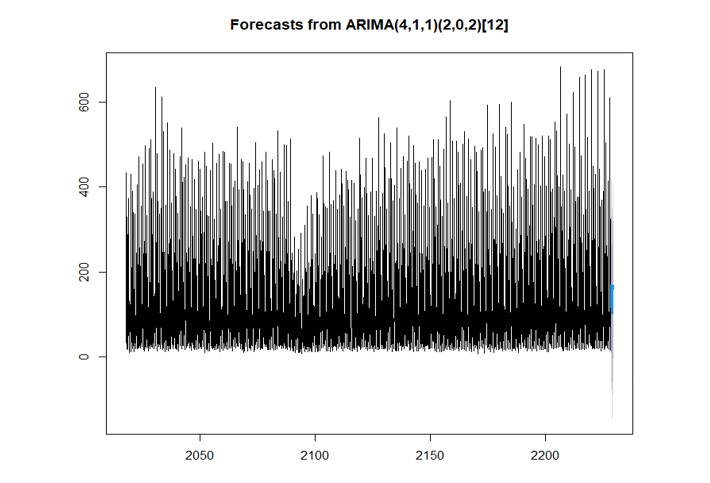

### 7. Get residuals of the ARIMA model
```R

residuals <- residuals(arima_model)

- Plot residuals to visually inspect
plot(residuals, main="Residuals from ARIMA Model", ylab="Residuals", xlab="Time")

- Assuming the ARIMA model is stored in 'model'
residuals <- residuals(model)  # Extract residuals from the fitted ARIMA model

- Plot residuals to visually inspect
plot(residuals, main="Residuals from ARIMA Model", ylab="Residuals", xlab="Time")
```
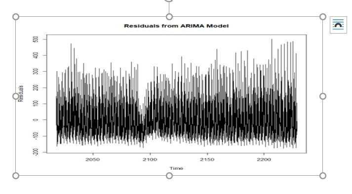

### 8. Perform the Shapiro-Wilk test for normality of residuals
```R
shapiro_test <- shapiro.test(residuals)
print(shapiro_test)
```
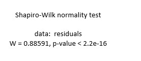

### 9. Forecast future values using the correct model object
```R
forecast_values <- forecast(model, h=12)

- Step 9: Plot the forecasted values
plot(forecast_values)

- Print the forecasted values
print(forecast_values)
```


# Conclusion and Recommendation

##Observations from the Graphs

There is a decline in diagnoses in 2020 visible in both moving averages. This could be linked to the global impact of the COVID-19 pandemic, which disrupted healthcare services, causing fewer screenings and diagnoses. After 2020, the charts suggest a recovery trend, with diagnosis rates increasing in both short and long terms, indicating a resumption of healthcare activities. The 3-month moving average shows seasonal variability, with some months experiencing higher rates of diagnoses than others. The 12-month moving average points to an overall stable or slightly increasing trend post-2020, suggesting improvements in cancer diagnosis rates over time.

p-value from the Augmented Dickey-Fuller (ADF) test is 0.01. Since your p-value (0.01) is less than 0.05 (the common significance level), reject the null hypothesis. This means that there is strong evidence to suggest that the time series is stationary. A p-value of 0.01 indicates that the time series is likely stationary and does not have a unit root. This is a good result, as stationarity is typically a necessary assumption for models like ARIMA.

The forecast suggests that the values in the future will likely follow a similar pattern to the historical data, but the variability in the forecast increases with time, especially in the distant future (shown by the wider confidence intervals). The model has captured the seasonality well, as reflected in the oscillations of the forecast aligned with the seasonal patterns in the data. The high volatility (spikes) in the forecast toward the end of the series may indicate unusual events or outliers that the model has trouble predicting precisely.

## Structure and Behavior of Residuals:
The residuals appear to fluctuate around a mean of approximately zero, which is desirable in a well-fitted ARIMA model. This suggests that the model is unbiased on average.
However, there seems to be considerable variability in the residuals, with some periods having higher spikes than others.
Variance Consistency:
The residuals show relatively consistent variance throughout the time series, which indicates that the assumption of homoscedasticity (constant variance) may hold. Any noticeable increase or clustering in variance over time would suggest issues in the model.

- Extreme Values:
There are some noticeable extreme spikes, both positive and negative, which could represent outliers in the data or periods where the model underperformed.


## Actionable Recommendations for Stakeholders
- Resource Allocation:
Use the 3-month average to identify periods of high demand for diagnostic services and allocate resources accordingly (e.g., hiring more staff during peak times or increasing diagnostic capacity).

- Policy Adjustments:
Analyze the drop in 2020 to ensure contingency plans for similar disruptions in the future. Monitoring and Evaluation: Use the 12-month average to evaluate the long-term effectiveness of public health campaigns or diagnostic initiatives. 
Public Awareness Campaigns: Focus campaigns during months of low diagnoses (as seen in the 3-month average) to address potential gaps in awareness or service access.

## Sum of Cancer Diagnoses and 12-Month Moving Average by Year:

- Trend Analysis: 
The graph indicates a fluctuating pattern in the sum of cancer diagnoses, with a noticeable dip in recent years.

- 12-Month Moving Average: 
The moving average shows a smoother trend over the years, which could help identify broader patterns without being influenced by short-term fluctuations.

- Insight: 
There appears to be a significant decline in diagnoses after 2021, which could be worth investigating further, possibly to identify changes in healthcare access or diagnostic practices. A drop in diagnoses could also be due to factors such as changes in reporting, delays caused by external events like the COVID-19 pandemic, or other public health impacts.

## Sum of Cancer Diagnoses by Year and Cancer Group:
- Data Breakdown by Cancer Group: 
This graph breaks down the cancer diagnoses by specific types (e.g., Bladder, Bone, and soft tissues). Insight: The graph shows varying trends across different cancer types. For example, Bladder cancer diagnoses seem to have the highest sum of cases in most years, while Bone and soft tissue cancers might show a smaller proportion but still demonstrate a steady increase.
- Trend Variations: 
The behavior of each cancer type may suggest that diagnostic patterns or healthcare responses differ across cancer groups. It would be useful to explore why certain cancers are increasing more rapidly than others or why some are declining.

## Total Cancer Diagnoses by Year and Cancer Group:
Overall Trend: This graph tracks the total cancer diagnoses over the years, which includes all cancer groups combined. The sum fluctuates but seems to exhibit a slight increase up to 2022 and then potentially stabilizing or slightly decreasing.
Insight: The graph suggests that, despite fluctuations in the total number of diagnoses, some specific cancer groups are seeing increased numbers, while others are either stable or decreasing. This could indicate a shift in cancer types being diagnosed more frequently.

## Summary:

- Yearly Fluctuations: 
Overall, there’s a visible fluctuation in the data, which could be impacted by multiple factors like changes in diagnostic practices, public health policies, or even improvements in early detection techniques.
- Cancer Type-Specific Analysis: 
Different cancer types have different diagnostic patterns. Identifying which cancer types are more prevalent could help guide public health initiatives or resource allocation.
- Potential Decline: 
The decline in diagnoses seen in the first graph should be further explored. It might indicate a broader trend related to the healthcare system or environmental factors.


